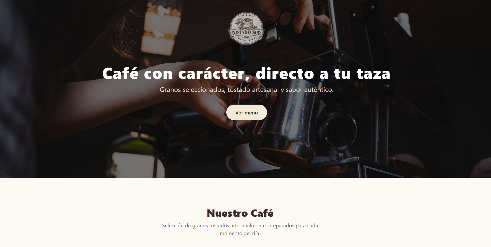
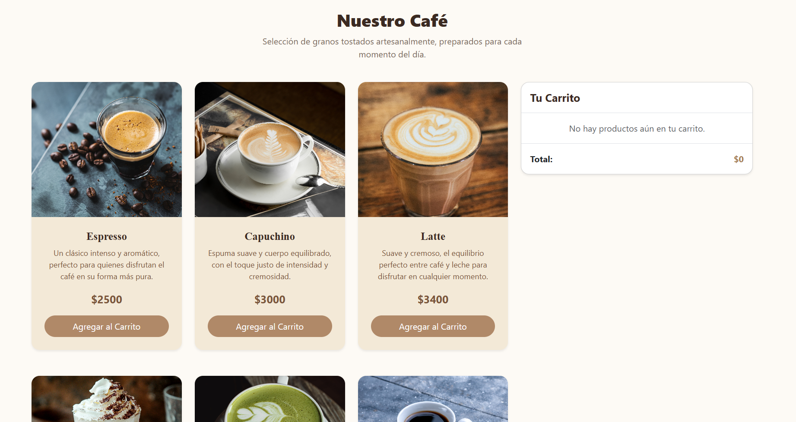

☕ Tostado Sur – Coffee Shop E-Commerce

Aplicación web de una cafetería que simula un mini e-commerce, desarrollada con Vue 3. Permite explorar productos, agregarlos a un carrito dinámico y gestionar cantidades en tiempo real.

## 📸 Vista previa

### Hero

  

### Menú y carrito

  

🔗 Demo en vivo:
https://javieraLoy.github.io/Coffe-shop/

✨ Características:
🛒 Carrito de compras dinámico.
➕➖ Control de cantidad por producto.
🚫 Límite de 10 unidades por café.
💬 Feedback visual al usuario.
🎨 Diseño moderno con enfoque en experiencia de usuario.
☕ Identidad visual tipo cafetería artesanal.

🧩 Componentes principales:

ProductoCard.vue
• Recibe props: nombre, precio, imagen, descripcion.
• Emite evento: $emit('add-to-cart').

Carrito.vue
• Muestra productos agregados
• Permite:
- Aumentar/disminuir cantidad
- Eliminar productos
• Recibe props:
- items
- total

🔄 Comunicación entre componentes:

Este proyecto se enfoca en la comunicación entre componentes usando:

Props → paso de datos desde el padre a hijos.
Emits → envío de eventos desde hijos al padre.

🧠 Lógica del carrito:
• Manejo de estado con ref
• Cálculo automático del total con computed
• Validación de límite por producto (máx. 10 unidades)

🛠️ Tecnologías utilizadas:
• Vue 3 (Composition API)
• Vite
• JavaScript (ES6+)
• Bootstrap 5
• CSS (BEM)

🚀 Instalación y uso
# clonar repositorio
git clone https://github.com/JavieraLoy/Coffe-shop.git

# entrar al proyecto
cd proyecto-ecommerce

# instalar dependencias
npm install

# ejecutar en desarrollo
npm run dev

📦 Build y Deploy
npm run build
npm run deploy

📌 Contexto del proyecto

Este proyecto fue desarrollado como parte de un ejercicio enfocado en:

• Comunicación entre componentes en Vue.
• Uso de Props y Emits.
• Manejo de estado reactivo.
• Buenas prácticas de UI/UX.

👩‍💻 Autor

Javiera Loyola